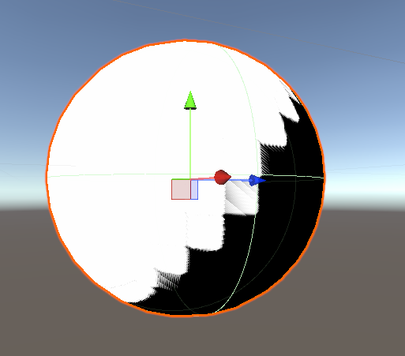
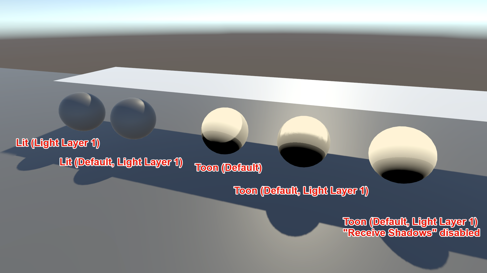

# Troubleshooting and Tips

This page contains common issues, workarounds, and tips for using **Unity Toon Shader** effectively.

## Shadow Acne

When [Receive shadows](ShadingStepAndFeather.md#receive-shadows) is enabled, you may observe **shadow acne** -
areas within shadows that appear noisy. This is due to self-shadowing artifacts where the shader's shadow
calculations interact with the geometry of the model, causing small discrepancies in depth that result in visible
noise.

### Workarounds for Universal Render Pipeline (URP)

There are several approaches to address shadow acne in URP:

1. **Use Rendering Layers with Custom Shadow Layers**: This method gives you fine-grained control over which objects
   cast shadows on which surfaces, helping eliminate unwanted shadow artifacts while keeping all objects properly lit.

   

   This is an example of a step-by-step setup:

   a. **Enable Rendering Layers in URP Asset**:
      - Select your URP Asset
      - Enable [**Rendering Layers**](https://docs.unity3d.com/Manual/urp/features/rendering-layers-lights.html) with
        **Custom Shadow Layers**

   b. **Set up the scene**:
      - Add a plane GameObject as the floor
      - Add a sphere with a Toon material. Set its **Rendering Layer Mask** to "Default"
      - Add another sphere with a Toon material. Set its **Rendering Layer Mask** to "Default" and
        "Light Layer 1"
      - Add a plane GameObject above the spheres that will cast shadows. Set its **Rendering Layer Mask** to
        "Default" and "Light Layer 1"

   c. **Configure the Light**:
      - Select your Light (typically a Directional Light)
      - Set the light to render to both layers: "Default" and "Light Layer 1"
      - Set the light to only cast shadows on "Light Layer 1"

   This configuration allows you to control which objects receive shadows while all objects remain lit, helping
   eliminate shadow acne on specific objects.

   For more information, refer to the
   [Universal Render Pipeline documentation](https://docs.unity3d.com/Packages/com.unity.render-pipelines.universal@latest).

2. Disable [Receive shadows](ShadingStepAndFeather.md#receive-shadows) entirely on affected materials
3. Adjust the **System Shadow Level** parameter to reduce the intensity of system shadows

